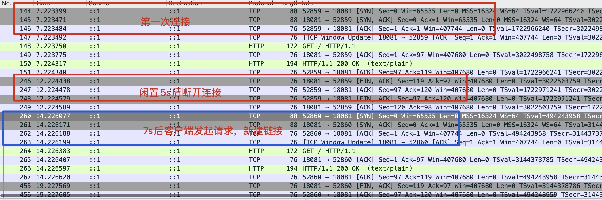

## 服务端清理空闲连接

### 流程
服务端设置5s闲置时间，客户端发起两次请求，请求间隔是7s
 
 

初始化server时，配置IdleTimeout的时间即可,IdleTimeout是当启用keep-alive时等待下一个请求的最大时间。

 
 
不过这里有个坑:
如果IdleTimeout为零，则使用ReadTimeout的值。如果两者都是零，则没有超时。

### 抓包结果
